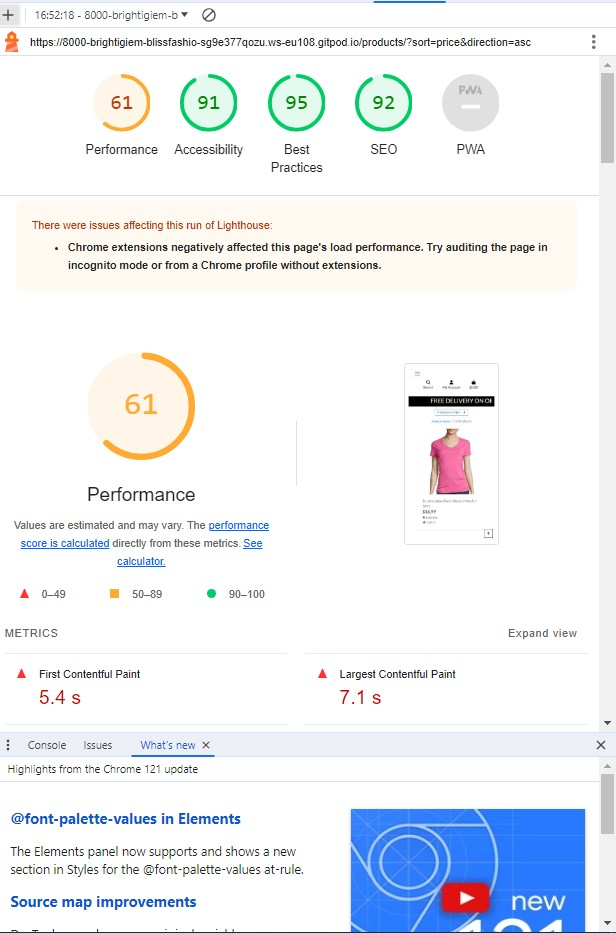
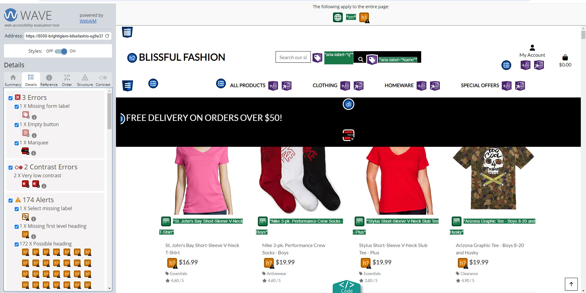

Visit the live site [Here.](https://blissful-fashion-0cb729cb8dac.herokuapp.com/ "Link to Blissful Fashion site")

---


## CONTENTS

* [Project Overview](#project-overview)
  * [Project Goals](#project-goals)

* [User Experience](#user-experience)
  * [User Expectations](#user-expectations)
  * [User Stories](#user-stories)

* [Design](#design)
  * [Colour Scheme](#colour-scheme)
  * [Database Design](#database-design)
  * [Wireframes](#wireframes)

* [Features](#features)

* [Future Implementations](#future-implementations)

* [Technologies Used](#technologies-used)
  * [Languages Used](#languages-used)
  * [Programs Used](#programs-used)

* [Deployment](#deployment)

* [Testing](#testing)

* [Credits](#credits)
  * [Code used and adapted](#code-used-and-adapted)
  * [Websites visited for info and solutions](#websites-visited-for-info-and-solutions)
  * [Acknowledgments](#acknowledgments)

---
## **Project Overview**

# Blissful Fashion Store

Blissful Fashion Store is an E-commerce site for shoppers who would love to go online and get items for their homes. the site is very secure with a secure payment system from stripe. this site offer users with great benefits and users are able to get their orders delivered to them on a next day delivery system all over Europe and UK.
this is a easy to use site that have image of products and quantity needed can be selected by customer and placed in a basket until customer is done with shopping then can go to cart to see abd pay for item selected. 
in the basket customers can chose to reduce the quantity of items they have previously selected and can also add to the quantity before making a payment. details of deliver address and names are require to complete the transactions.
some of the benefits giving to customers are: 
1. customers wouldn't be charged for delivery of times above the amount......
2. there is a coupon offer for regular shopper / customers who have made a large order. such coupon are forworded to their email as a thank you gesture
3. customers can login / register easily using their google or github accounts .

---

- __front page view__

  - this is the main / front page of the site . it welcomes choppers to the site with information of sales available to them. here a shopper can decide to go shopping by clicking on the shop now to open the door to an amazing world of items for shopping.
  - the page have search bar at the top which will give customers the opportunity to search for what they would want to buy directly.
  - this page also have the user login / registration link for customers who already have an account or would love to have an account.
  - this page have carts where customer can see what they have kept on the cart and total cost.
  - this page have links to the products, special offers, hardwares and cloths .
  links are all responsive and user can click on the store name to get to this page at any time.


  
---

### **Project Goals**

 - Develop Blissful-Fashion website using Django and python frameworks
 - Present the site easy to use and understand
 - Keep good UX principles regarding layout/colours/interaction
 - Robust Python code without issues/bugs
 - Fully responsive and immersive


[Back to top ⇧](#Blissful-Fashion)

---

## **User Experience**

### **User Expectations**

 - shopper can view a list of products and select items to purchase
 - Shopper can view individual products details, price , reviews/ratings and descriptions
 - Shopper can easily identify deals, clearance items and special offers so as to take advantage of special savings for products
 - Shopper can see their total spending on the Carts for items picked to avoid spending too much.
 - Shopper can take advantage on the next day delivery options
 - Shoppers can take advantage of the Coupon/voucher offers 

### **User Stories**

#### **First Time Visitor**
   - Users can easily register for an account so as to be able to view my profile
   - Users can easily log/register for an account using my social media accounts so as to save time and have all details inputed automatically
   - Users can easily log in or out of my account and profile so as to keep my details safe
   - Users can easily get password reset if need be so as to get access to my account
   - Users can can get confirmation emails for registration so as to confirm account have been registered successfully
   - Users can sort list of available products so as to Identify the best price, best product rating and categorically sort products
   - users can easy see products they are searched for and numbers of results so as to easily know if the product i want is available
   - Users can easy select products quantity to ensure they dont mistakely select wrong quantities

#### **Features**
  - Blissful Fashion Store has offers on sales for customers who would enjoy to shop at a cheaper rate for more valuable items,
  - Blissful Fashion Store has next day delivery features for customers who would love to get their item faster
  - Blissful Fashion Store has coupon gifts for customer to help reduce the cost on their shopping
  - Blissful Fashion Store has a large rage of products from cloths to hardware making it convienent to shop in one place
  - Blissful Fashion Store has a secure payment system for all cards payment
  - Blissful Fashion Store has customer review section to help the store understand what they think about the products
  - Blissful Fashion Store has a great navigation option for customers as they can select between products they would like to view.
  - Blissful Fashion Store has a search option for customers to be able to search what they would like to purchase easily
  - Blissful Fashion Store made it easy for non registered shoppers can still shop without any issues
  - Blissful Fashion Store has the option for customers to login / register easily using their social media accounts, google and github
  #### **Returning User/Agent**
   - I want to log in securely and have access to my profiles
   - I want to be able to signin or register securely using my social accounts
   - I want to see list of available product and details of products
   - I want to be able to add products to carts
   - I want to be able to leave my reviews on each products
   - I want to be able to delete products from my carts
   - I want to be able to increase or reduce each products quantity on my Carts
   - I want to be able to see the total of my picked products before checking out
   - I want to be able to check out securely using a secure payment method
   - I want to be able to signout of my profile when i am done

  #### **Website Admin/Director**
   - I want to log in securely and have admin access
   - I want to approve and publish user accounts
   - I want to users orders
   - I want to create Coupon for users
   - I want to be able to add / delete products in store
   - I want to delete user  
   - I want to add products / delete products for sale

[Back to top ⇧](#Blissful-Fashion)

---

## **Design**

### **Colour Scheme**

the colors used are very warm and visable colors. user friendly


### **Structure**

  - Blissful Fashion is structured in a user friendly and easy to navigate way.

  - *index page:*

    - This page welcome users to the amazing world of shopping with Blissful Fashion, it has navigation links for products and 
    -  base template is created with head, navigation and footer being the same on signup and login pages, adding specific page content to it.
    - User can enter the home page using 'SHOP NOW' button presented at the middle of intro page, or use navigation link at the top of the page.
    - User can open home page (signup) with more detailed info about the Blissful Fashion. 
    - User can also get autenticated using Social accounts like Google / Github.
    

  - *Registerig, logging in/out:*  
    - While users can still shop on this site without registering, the site dues support users who will like to have a profile account so as to have / see the order details and historys. On the right top corner of the page users are able to register or login to their profile. Blissful Fashion has made this easier by creating a link for users to login / register using their social accounts like Github or Google. confirmation email is sent to the email of first time user to verify their identity after which an account is created and user can the control and maintain their profile.

    - first time users who choose to use social media account for registration are redirected to the social media account for Authorisation,
    - New user get a message after successful registration, "Congratulations, You are now Registered".
    
    - Upon registering, the 'Register' link is replaced by 'Logout' link, allowing the user to sign out from the site.
    - Logged in users will see their profile and can edit it in the top right corner.
    - The user can view items for sale.
    - The user can add item to basket.
    - The user can leave a review.
    - When logging out, the user is asked 'Are you sure' before signing out.
    - When signed out, the user is brought to the index.

- __Products Page__

  - this page display all products available in the store , customers can scroll through the list of times and clich on them if they want to get some more discribtions
  - All items can be clicked to deplay items details and quantitie selected before adding to carts
  - Hardware Page displays hardwares like tolls for kids and other kitchen hardwares like pots


  - __Special Offers Page__

  - Special Offers Page displays items on offers , these are discounted products due to age or seasons but till at good qualitys


- __Hardware Page__

  - Hardware Page displays hardwares like tolls for kids and other kitchen hardwares like pots


- __Cloths Page__

  - Cloths Page displays cloths for both male and female, boys and girls including babies.


  - *Footer:*
    - Footer is retained on all pages and contains information and contact details of the designer .
    - Footer also contains copyright for both this project.


   
  - *Error pages*
    - Two error pages are supported, 404 (page not found) and 500 (internal server error), both with buttons that guide the user back to the home page.  

- *Contact us page*
    - Contact us page have been setup to enable Users write to us about complaint or improvements. as customer feedback is always import for a business this have been added.   


- font awesome was used alot to added styles to the website. expecially at the footer where it was used to add social media accounts and linked to developers site.
- Favicon was also included to this site to make the link look more personalised and organised.

 
- Footer links open in a new tab, tooltips present on logo, title and footer links.


  - Database schema:

  - *Event*

| Field Name      | Field Type              | Description                                   |
| --------------- | ----------------------- | --------------------------------------------- |
| id              | IntegerField (PK)       | Primary key for the event                                       |
| title           | CharField               | The title of the event                                       |
| slug            | SlugField               | A slugified version of the title for URL purposes          |
| author_id       | ForeignKey (User)       | Foreign key to the User table 
|
| excerpt         | TextField               | Excerpt of the event  |
| updated_on      | DateTimeField           | The datetime when the event was last updated           |
| content         | TextField               | The content of the event                       |
| created_on      | DateTimeField           | The datetime when the event was created           |
| approved        | BooleanField            | Indicates whether the event is approved          |
| status          | IntegerField            | Status of the event (0 for Draft, 1 for Published)        |
event             |

  - *Comment*

| Field Name  | Field Type              | Description                                 
|
| ----------- | ----------------------- | --------------------------------------------- |
| id          | IntegerField (PK)       | Primary key for the comment                                 |
| post_id     | ForeignKey (Event)      | Foreign key to the Event table                 |
| name        | CharField               | Name of the commenter                          |
| email       | EmailField              | Email of the commenter                         |
| body        | TextField               | The comment text                               |
| created_on  | DateTimeField           | The datetime when the comment was created      |
| approved    | BooleanField            | Indicates whether the comment is approved      |
| status      | IntegerField            | Status of the comment (0 for Draft, 1 for Published) |

The provided database schema consists of two tables: Event and Comment. The Event table contains fields: event's unique identifier, title, slug for URL purposes, author reference, featured image, excerpt, content, creation and update timestamps, approval status, and a status indicator. Additionally, there are many-to-many fields for users who liked or disliked the event. The Comment table includes fields like the comment's ID, associated event, commenter's name and email, comment body, creation timestamp, approval status, and a status indicator. This schema enables the storage and organization of events with their respective comments, providing a structured and efficient way to manage and retrieve event-related data.

### **Wireframes**

Wireframes for the project were developed right after the idea for the project was chosen.
Wireframes for Assessment Guide and Project Planning & Ux were made before the ones for the content of the pages themselves.

<details>
<summary>Assessment guide wireframe</summary>


</details>

<details>

There are three wireframes for the project. Using Agile, the basic or Minimal Viable Product (MVP) was to be made first, then if time allows it the scope can increase, making the project grow towards Enhanced and finally Superior project.

Differences between scopes were considered early as to allow for the use of Agile methodology. Personal, work, family, dependants and health situations were considered to have impact on time available for the project. Ideally, maximum time was to be taken to finish the project making the scope bigger.


## **Agile Project Management**

This project was developed using the Agile methodology.
The key principles adopted were; focus on the essential features first, work in small iterations and add extra features/expand scope as time permitted.


**Agile Planning**

Before writing any code, everything was considered and planned as much as possible.


1. EPIC - Django Setup and early deployment
2. EPIC - Set up models and views
3. EPIC - User registration/login, CRUD
4. EPIC - Content and navigation - basic
5. EPIC - Content and navigation beautify/Testing
6. EPIC - Logic/functionality enhancements
7. EPIC - Ux/content enhancements
8. EPIC - Logic/functionality enhancements
9. EPIC - Ux/content enhancements
10. EPIC - README update and finish up
</details>

<details>


## **Features**

All of the features presented in this sections are fully responsive on all devices and screen widths.
Please refer to [TESTING.md](/TESTING.md) for more information about responsiveness testing.


## **Future Implementations**
The following features could be added to Blissful-fashion in the future. Project deadline influenced heavily what was left out.
- Clean up of style.css. The css file is very big, consisting of more than 5 000 lines of code (not minified). The solution was looked for ([PurgeCSS](https://medium.com/dwarves-foundation/remove-unused-css-styles-from-bootstrap-using-purgecss-88395a2c5772)) and tried but was not successful within the project submission timeframe.
- registration confirmation page

These were only some of project enhancements that could be done. Using other Django apps and other API-s, logic and creativity could make this project into something really wonderful.
- a more detailed readme
- set secret key


## **Already Implemented**
  - Ability for the user to add their comments / reviews
  - Add email required, working email verification and password recovery
  - Gmail signin / restration obtions
  - GitHub sign in button on Register page
  - Footer
  - contact us
  - link to developer
  


[Back to top ⇧](#Blissful-Fashion)

---
### <div id="manual_testing">Manual Testing</div>

|  Test |  Result |   
|---|---|
| When the user clicks on Google icon they can register/login into a account. | Pass |
| When the user clicks on Github icon they can register/login into a account. | Pass |
| When the user chooses an item they can add them to chart. | Pass |
| When the user add time to their basket they can check out securely. | Pass |
| When the user add coupon they get discount from their purchase. | Pass |
| When the User add next day delivery option cost is added to their purchase. | Pass |
| when the User add reviews to products , reviews are saved | Pass |
| When the user fill the contact us form they get a feedback to confirm message sent | Pass |
| When the user subcribe for the monthly news letter they get confirmation back | Pass |

[Back to top ⇧](#Blissful-Fashion)

---

## **Technologies Used**

### **Languages Used**

- [HTML](https://en.wikipedia.org/wiki/HTML5) - For adding content and formatting.
- [CSS](https://en.wikipedia.org/wiki/CSS) - For adding style and colours.
- [JavaScript](https://en.wikipedia.org/wiki/JavaScript) - For adding interactive features.
- [Python](https://en.wikipedia.org/wiki/Python_(programming_language)) - High-level, general-purpose programming language.

### **Django and Python Packages**

- [Django](https://www.djangoproject.com/) - A Python-based web framework that follows the model-template-view architectural pattern, used for building the project.
- [django-allauth](https://django-allauth.readthedocs.io/) - A Django application used for account registration, management, and authentication.
- [Amazon Web Services](https://aws.amazon.com/) - A Django storage backend for AWS, used for image hosting and storage.
- [crispy_forms](https://django-crispy-forms.readthedocs.io/) - A Django application that makes it easy to style Django forms.
- [crispy_bootstrap5](https://pypi.org/project/crispy-bootstrap5/) - A package that provides Bootstrap 5 styling for Django crispy-forms.

### **Programs/Tools Used**

- [GitHub](https://github.com/) - Source code hosted on GitHub, deployed using Git Pages.
- [GitPod](https://www.gitpod.io/) - Used to commit, comment and push code during the development process.
- [Font Awesome](https://fontawesome.com/) - Font Awesome use dto source necessary icons used in the project.
- [LanguageTool](https://languagetool.org/) - Used for general spell-check.
- [Google Fonts](https://fonts.google.com/) - Used to import fonts to the project.
- [Heroku](https://www.heroku.com/) - Used to deploy the project.
- [ElephantSQL](https://www.elephantsql.com/) - Free and open-source relational database management system (RDBMS).
- [JsHint](https://jshint.com/) - Used for validating the javascript code.
- [CI Python Linter](https://pep8ci.herokuapp.com/#) - Used for validating the python code.
- [HTML W3C HTML Validator](https://validator.w3.org/#validate_by_uri+with_options) - Used for validating the HTML.
- [CSS Jigsaw CSS Validator](https://jigsaw.w3.org/css-validator/#validate_by_uri) - Used for validating the CSS.
- [Chrome Del Tools](https://developer.chrome.com/docs/devtools/) - For debugging the project.
- [W.A.V.E.](https://wave.webaim.org/) - Used for testing accessibility.
- [LightHouse](https://developer.chrome.com/docs/lighthouse/overview/) - Used for testing performance.
- [Amazon Web Services](https://s3.console.aws.amazon.com/s3/buckets/blissful-fashion-bucket?region=eu-north-1&bucketType=general&tab=objects) - Used for static files.
- [Stripe](https://stripe.com/) - Used for financial transactions. Card payment services.

[Back to top ⇧](#Blissful-Fashion)

---

## **Deployment**

- Clone Code Institute Template Repository
- Initialize GitPod Workspace by clicking on the GitPod button on the repository
- Install support libraries and Django according to the guide on Code Institute
- Create requirements.txt
- Create Django project
- Set up ElephantSQL Account
- Set up AWS Account
- Create Heroku app
- For the final deployment, the debug setting in settings.py must be set to 'DEVELOPMENT' in os.environ
- Before final deployment, the DISABLE_COLLECTSTATIC config var in Heroku was removed
- Before deployment all static and media files added to AWS bucket created
- From Heroku connect to github repository 
- Deploy from selected GitHub branch
- Click on Deploy button => project is now deployed.

An early deployment guide was made before project start to ensure success in creating the project:
<details>
<summary>Early deployment guide</summary>


<django-admin startproject PROJ_NAME .>   


python3 manage.py startapp APP_NAME

=== in settings.py, to INSTALLED_APPS array, add APP_NAME

python3 manage.py migrate

python3 manage.py runserver  ===> for TESTING, should see django install congrats

DO NOT COMMIT

HIDING SECRET KEY
- Cut this from settings.py =>
- SECRET_KEY = '-----your secret key-----'
- Write this in settings.py =>
- from decouple import config
- SECRET_KEY = config("SECRET_KEY")
- Write this in terminal or cmd =>
- pip install python-decouple


## **Deployment**
- All static files and media were all exported to amazon web services from where the files are loaded to our site.
- AWS S3 Bucket and IAM were setup and connfigured to store and share static files and media
to INSTALLED_APPS in settings.py add:
```
    'django.contrib.admin',
    'django.contrib.auth',
    'django.contrib.contenttypes',
    'django.contrib.sessions',
    'django.contrib.messages',
    'django.contrib.staticfiles',
    'django.contrib.sites',
    'allauth',
    'allauth.account',
    'allauth.socialaccount',
    'allauth.socialaccount.providers.google', 
    'allauth.socialaccount.providers.facebook', 
    'allauth.socialaccount.providers.github', 
    'home',
    'products',
    'bag',
    'checkout',
    'profiles',
    'crispy_forms',
    'crispy_bootstrap5',
    'storages',
```

## Automated Testing

### **W3C HTML Validator**

The [HTML W3C HTML Validator](https://validator.w3.org/#validate_by_uri+with_options) was used to validate the HTML code used, showing no errors except on single report page, 'strike' element is obsolete. As this is a feature (text censoring from admin site) and works as intended, the error is disregarded.
- at the last minute to my submitting this project i have discoverred some broken links due to my testing and adjusting site. i have now under most of the changes just to cause the site to run well and project submitted due to the last minute. there changes includ the extra spaces for all python codes.
 
 <br>

 

 - SignUp
 <br>

 


 - Index page
 <br>

 

 - product page
 <br>

 


### **W3C CSS Validator**

The [CSS Jigsaw CSS Validator](https://jigsaw.w3.org/css-validator/#validate_by_uri) was used to validate the CSS code used, showing 1 error and 786 warnings. no change was done to this, As that's a 3rd party service (font-awesome) there's nothing that you can do about that particular error.

 - CSS validation
 <br>

 

### **JSHINT Javascript Validator**

The [JsHint](https://jshint.com/) was used to validate the Javascript code used, showing no errors, but just 2 warnings which i couldn't do anything about as this was not an issue i could solve.

 - Javascript validation
 <br>

 
 


### **CI Python Linter**

The [CI Python Linter](https://pep8ci.herokuapp.com/) was used to validate the Python code used, showing no errors except for 'line too long'. there was no time to break all of the long code as i was also worried about breaking my code. This could not be resolved despite best efforts due to short time.
- I also installed RUFF just to try to fix the long line issues but because i have not used it before and didnt want to exceed my deadline i have not implimented this in the code so as not to cause any errors at this final stage.

 - admin.py
 <br>

 

 - forms.py
 <br>

 


 - models.py
 <br>

 

 - settings.py
 <br>

 

 - urls.py
 <br>

 


### **Lighthouse**

The [LightHouse](https://developer.chrome.com/docs/lighthouse/overview/) was used for testing performance.

#### **Desktop**


 - Login
 <br>

 

 - SignOut
 <br>

 

 - Product
 <br>

 

 - Contact Us
 <br>

 

 - Bag
 <br>

 

#### **Mobile**

  - Login
 <br>

 - Login
 <br>

 

 - SignOut
 <br>

 

 - Product
 <br>

 

 - Contact Us
 <br>

 

 - Delete Report
 <br>

 

[Back to top ⇧]

---
## **Accessibility**

### **WAVE WebAim**

The [W.A.V.E.](https://wave.webaim.org/) was used to test for accessibility, showing 3 errors this is due to the use of Marquee and empty button. due to time for submittion this have not been solved. 2 contrast were ignored

 - Index
 <br>


 - Login
 <br>

 


 

[Back to top ⇧]

## **Credits**

### **Code used and adapted**


 - Code institute code was the base of this project and i have only improved on the code and added some features [Boutique Ado](https://learn.codeinstitute.net/courses/course-v1:CodeInstitute+EA101+2021_T1/courseware/eb05f06e62c64ac89823cc956fcd8191/3adff2bf4a78469db72c5330b1afa836/).

 - [Django documentation](https://docs.djangoproject.com/en/4.2/) was relied on to find code for back-end solutions and code.

 - How do create url to django Admin within user page (HTML), code found on [Stack Overflow](https://stackoverflow.com/questions/55917136/how-do-create-url-to-django-admin-within-my-user-page-html).

 - Error pages how-to, found [here](https://frontendshape.com/post/bootstrap-5-404-page-examples) and [here](https://studygyaan.com/django/how-to-use-custom-500-error-template-in-django).


 - Adding Social Authentication to Django, found [here](https://testdriven.io/blog/django-social-auth/).

 - Changing Text Animation CSS, found on [CodePen](https://codepen.io/codingyaar/pen/LYJQaBe).

 - Censor Bars Text Animation For Del Text, found [here](https://codemyui.com/censor-bars-%E2%96%88%E2%96%88%E2%96%88%E2%96%88-text-animation-for-del-text/).

 - CSS 3D Rotate Animation, found on [CodePen](https://codepen.io/sungaila/pen/LzMgjE).


### **Websites visited for info and solutions**

There were many sites visited during the duration of the project.
[Google](https://google.com/ "Google home page") was used to produce results of the specific query, and [Stack Overflow](https://stackoverflow.com/ "Stack Overflow home page") proved to be the best source of information for various queries/issues. 

Standouts are [Django documentation](https://docs.djangoproject.com/en/4.2/), [Bootstrap documentation](https://getbootstrap.com/docs/5.3/getting-started/introduction/) and [Django-blog](https://djangocentral.com/building-a-blog-application-with-django/),[youtube](youtube.com) this helped alot in getting most answers to many of my questions
A lot of other projects were looked into to help with development, standouts are [ PP5 Buotique Ado ](https://learn.codeinstitute.net/courses/course-v1:CodeInstitute+EA101+2021_T1/courseware/eb05f06e62c64ac89823cc956fcd8191/3adff2bf4a78469db72c5330b1afa836/).


###  **Acknowledgments**

This project is dedicated to my wife who have remain strong with me even through the 2 lost of our pregnancy during this 1year of study, it felt like hell but she gave me strenght to continue my project and never stopped pushing me to succeed.
thanks for all your support and kind words , for your strenght and resilance you are the best thing that have happened to me.

- To Shalon my beautiful girl. Thank you for being so understanding during the project work. Thank you from the bottom of my heart for being who you are, wonderful and delightful souls. You make me proud to be your dad.

- To CODE INSTITUTE for letting me use their Boutiqu Ado as a base template for this project. i couldnt have done it within the short time without your help.

- Special mentions to Destiny Franks (Desphixs) thank you so much for been there for me every single step of this project this is all to you . i am gratful for your kindness and understanding. you where the back born to this project success. 
- To Error By Night thanks alot for showing me the light and helping to answer my questions. i am gratfult for the team at discord for all your support.
- To my most amazing Coach/co-student Tomislav_5P. i am not sure what to say to you for always making yourself available to answer and see me succeed. you have become more of a brother that i have never met . you love and support is truly appreciated. you will always be so special to me for there is no way i will write my coding career success without you on the front page.
- Student support of Code Institute, thank you for granting the project deadline extension, it was much needed and appreciated.
- 
- Special thanks to Bojan Bakaric (co-student) whose Readme for project (FEDERAL BUREAU OF CONTROL) was used as a template for my readme. thanks alot for your support and advise.


[Back to top ⇧]

***